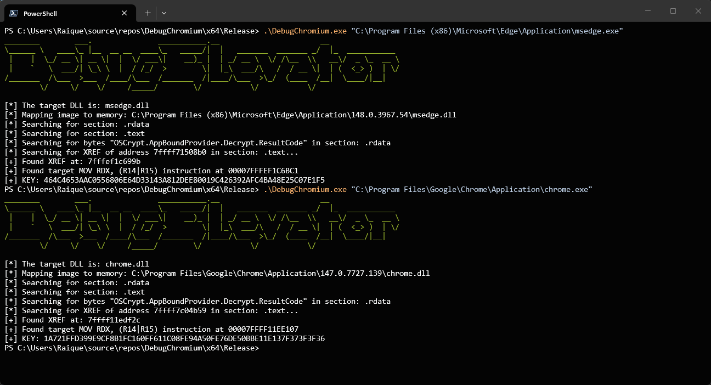
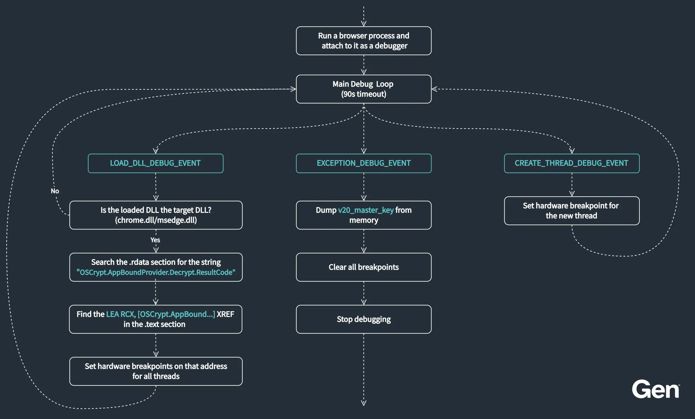
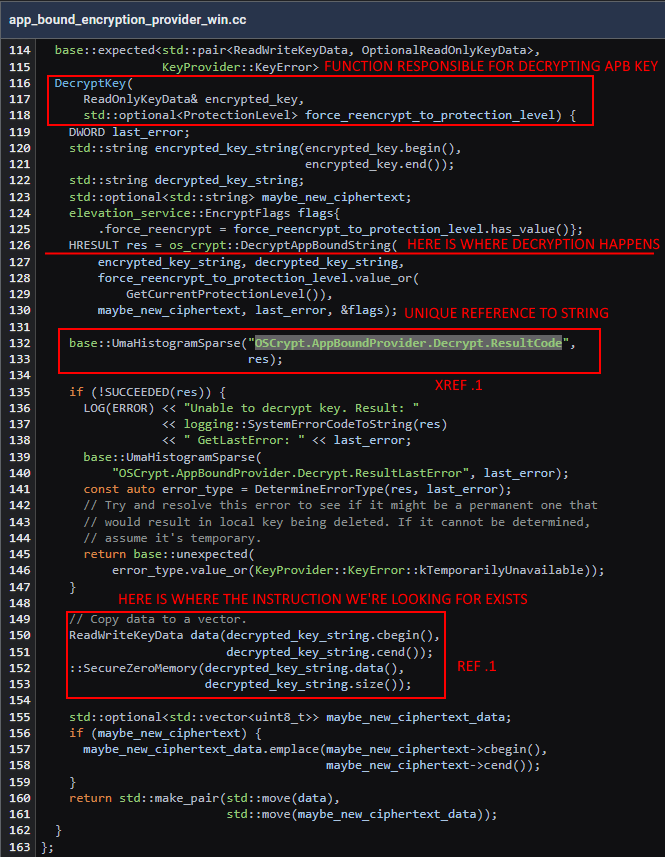
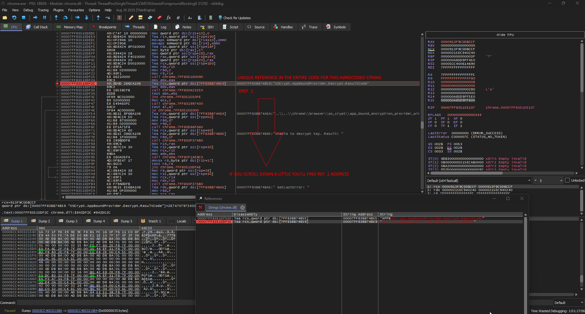
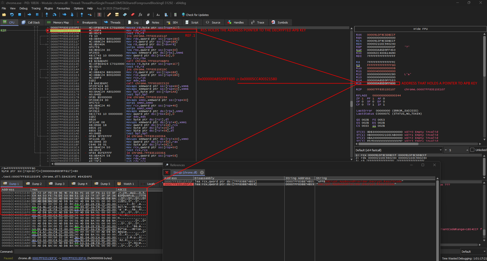

# Chromium-DebugElevator (`Chrome App-Bound Encryption Decryption`)

## 🚀 Overview
Chromium’s App-Bound Encryption was designed to raise the bar for stealing browser secrets. But recent research shows that attackers may not need payload injection, privilege escalation, or noisy post-exploitation tricks to get around it. In some cases, a debugger is enough.

### General Overview of the Debug process

### [Chromium - app_bound_encryption_provider_win.cc](https://source.chromium.org/chromium/chromium/src/+/main:chrome/browser/os_crypt/app_bound_encryption_provider_win.cc?q=OSCrypt.AppBoundProvider.Decrypt.ResultCode&ss=chromium)

### x64dbg - Unique reference to string

### x64dbg - MOVing key to RDX arg

